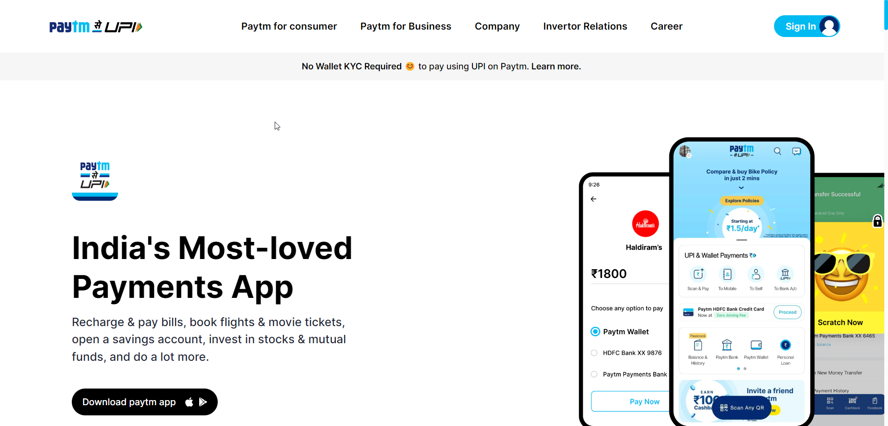

# Paytm UI Clone

> ## [Shivam Shukla](https://ishivamshukla.in)

 

## Tech Stack:

---

### Checkout the live website [here](#).

---

## My Learnings

-   Skills Gained in this project
    -   Learned to use TailwindCSS

---

## How the website looks like

